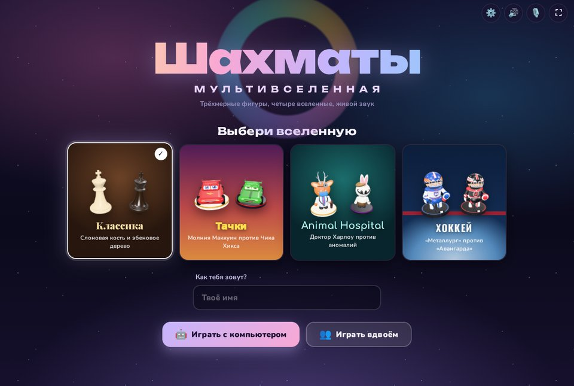
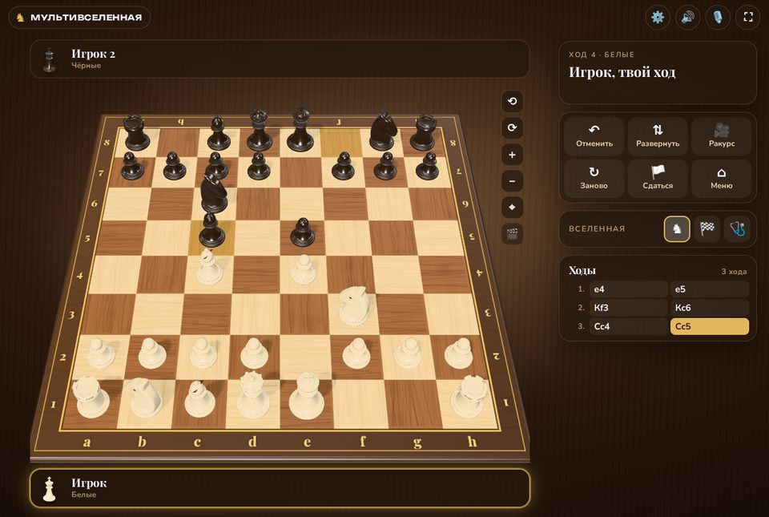
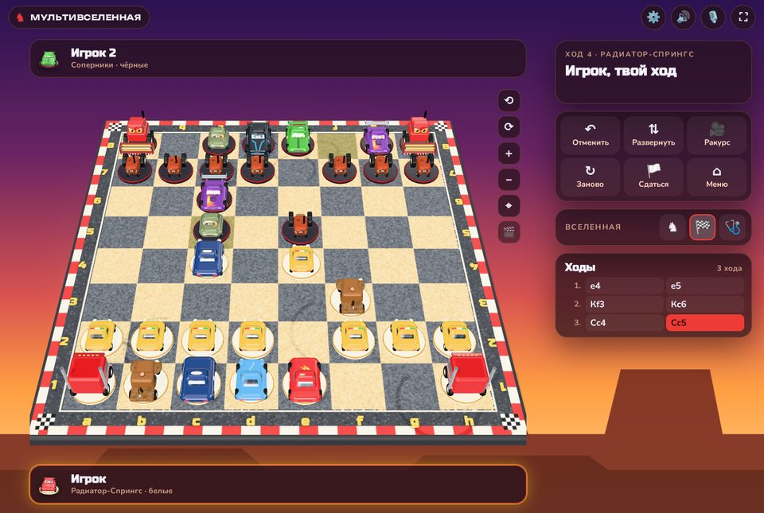
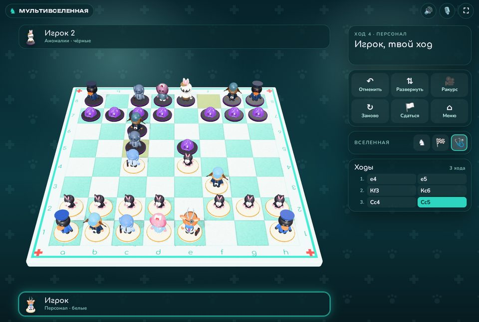
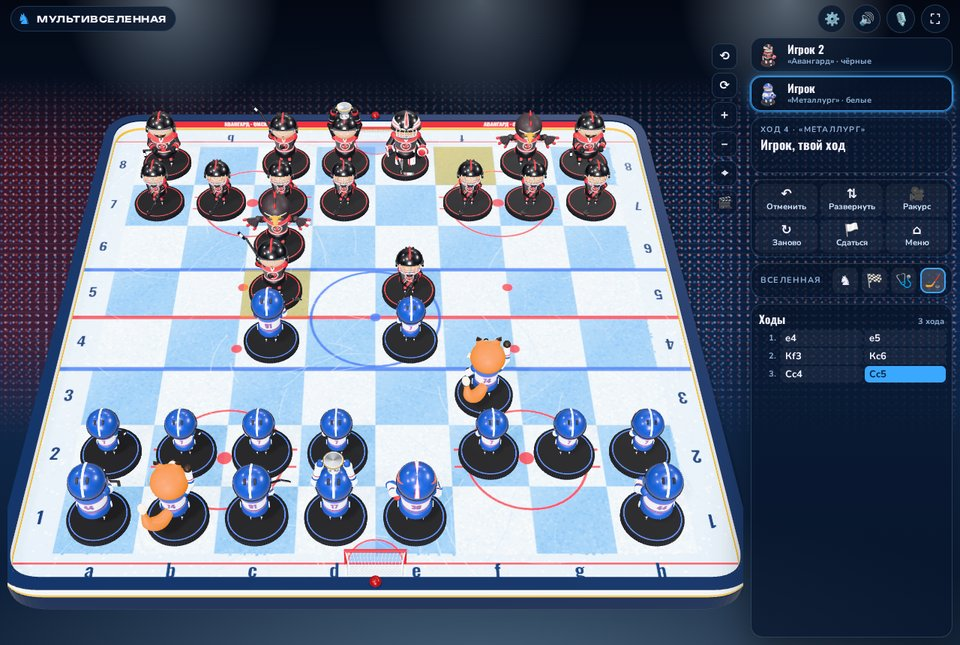
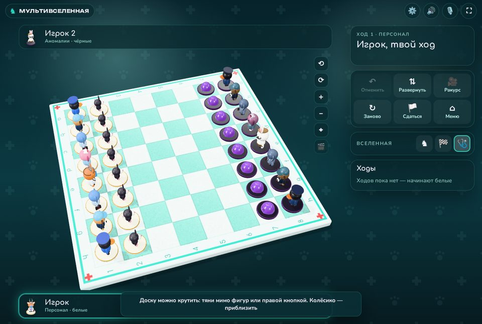
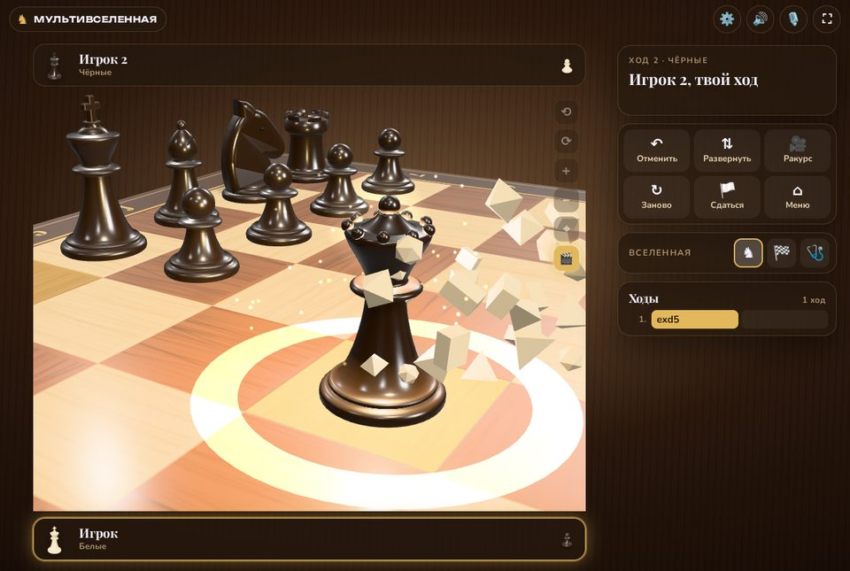
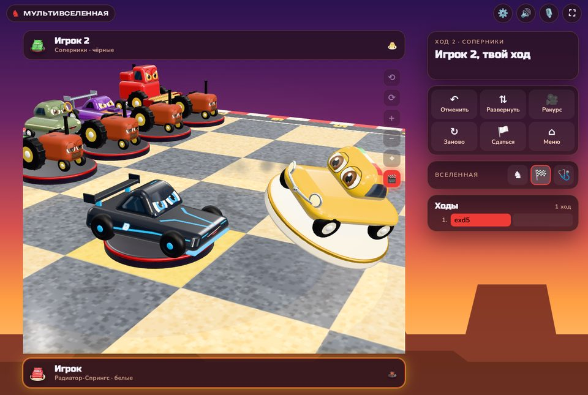
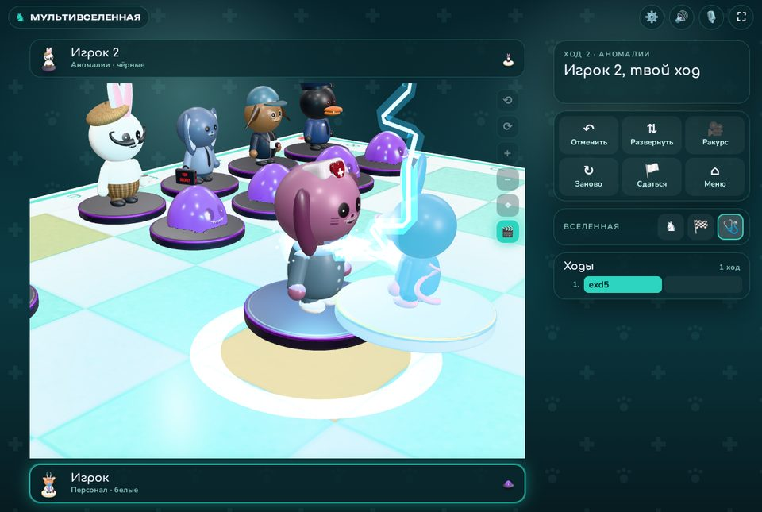
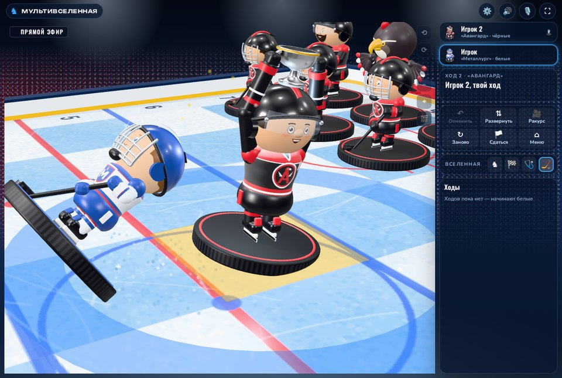

# ♟ Шахматы: Мультивселенная

Шахматы с объёмными 3D-фигурами в четырёх вселенных, компьютером-соперником трёх уровней,
синтезированными звуками и озвучкой победы и поражения. Работает в браузере без сборки
и без интернета: все библиотеки лежат в проекте.

**▶ Играть онлайн: https://vladmon-1981.github.io/chess-multiverse/**



| Классика | Тачки |
|:---:|:---:|
|  |  |
| **Animal Hospital** | **Хоккей** |
|  |  |

## Вселенные

Все фигуры — настоящие 3D-модели (Three.js, WebGL): со светом, тенями, бликами лака
и анимацией ходов. Модели построены в коде, без внешних файлов.

### ♞ Классика
Турнирные фигуры Стаунтона из слоновой кости и эбенового дерева под лаком, доска из клёна
и ореха с золотыми координатами. Фигуры плавно скользят по доске.

### 🏁 Тачки
Мультяшные машинки с глазами на лобовом стекле и ртом на бампере. Команды стоят носами
друг к другу. На ходу машинка поворачивает, едет с крутящимися колёсами и снова
разворачивается к соперникам.

| Фигура | Белые — Радиатор-Спрингс | Чёрные — соперники |
|---|---|---|
| Король | Молния Маккуин | Чик Хикс |
| Ферзь | Салли | Джексон Шторм |
| Ладья | Мак (тягач) | Фрэнк (комбайн) |
| Слон | Док Хадсон | Профессор Зет |
| Конь | Мэтр (эвакуатор) | Бууст |
| Пешка | Луиджи | Трактор |

### 🩺 Animal Hospital
Большеголовые звери из Roblox-игры про ночную смену в больнице. Персонал и аномалии
стоят лицом друг к другу и прыгают с клетки на клетку.

| Фигура | Белые — персонал | Чёрные — аномалии |
|---|---|---|
| Король | Доктор Харлоу (мунтжак с налобным зеркалом) | Барни (кролик с усами и в берете) |
| Ферзь | Медсестра | Аномалия-медсестра |
| Ладья | Офицер Дакман (утка-полицейский) | Аномалия-Дакман |
| Слон | Рон из бухгалтерии (вислоухий кролик) | Аномалия-Рон |
| Конь | Лиз (каракал-журналистка) | Аномалия-Лиз |
| Пешка | Рэттью (крыс) | Слизень-аномалия |

У аномалий пустые чёрные глаза и зубастые улыбки.

### 🏒 Хоккей
Матч на ледовой арене: омский «Авангард» против магнитогорского «Металлурга».
Поле — лёд с настоящей разметкой (красная центральная и синие линии, круги вбрасывания,
вратарские площадки), вокруг — борта со скруглёнными углами, ворота с сеткой, красные
фонари гола и щиты с названиями команд, за бортами — трибуны болельщиков.
«Металлург» играет белыми в белой выездной форме с синими и красными полосами,
«Авангард» — чёрными в чёрной форме с красным. Все фигуры стоят на шайбах, команды
смотрят друг на друга, как на вбрасывании.

| Фигура | Белые — «Металлург» | Чёрные — «Авангард» |
|---|---|---|
| Король | Вратарь в расписанной маске (пламя плавки), щитки, ловушка и блин | Вратарь в маске с перьями ястреба |
| Ферзь | Капитан с «К» на груди поднимает кубок | Капитан с кубком |
| Ладья | Защитник с клюшкой поперёк, борода и пластырь | Защитник |
| Слон | Снайпер замахнулся для щелчка | Снайпер |
| Конь | Лисёнок Тимоша, талисман клуба | Ястреб, талисман клуба |
| Пешка | Юниор в шлеме с решёткой ведёт шайбу | Юниор |

Хоккеисты ездят на коньках: разгоняются толчками, тормозят боком, поднимая ледяную
крошку, талисман перепрыгивает фигуры с вращением, как фигурист. Мат — это гол:
шайба влетает в ворота, за ними мигает красный фонарь и звучит сирена.

> Персонажи «Тачек» (© Disney/Pixar) и Animal Hospital (игра в Roblox) — фан-арт.
> Модели нарисованы с нуля и не являются официальными. Названия хоккейных клубов
> «Авангард» и «Металлург» использованы как фан-арт: эмблемы на свитерах и маски вратарей —
> собственная стилизация, а не официальные логотипы.

## Камера

Доску можно рассмотреть с любой стороны: камера вращается на 360°, наклоняется,
приближается и сдвигается.

| Действие | Мышь | Телефон и планшет |
|---|---|---|
| Крутить доску | тянуть мимо своих фигур или правой кнопкой | вести пальцем мимо своих фигур |
| Приблизить или отдалить | колёсико (к точке под курсором) | щипок двумя пальцами |
| Повернуть | — | поворот двух пальцев |
| Сдвинуть кадр | Shift + мышь или средняя кнопка | два пальца |

У доски есть кнопки ⟲ ⟳ (поворот на 45°), ＋ － и ⌖ (обычный вид). С клавиатуры работают
← →, + −, 0. Камеру можно крутить и пока соперник думает.



## Кинематографичные ходы и спецэффекты

Кинорежим включается кнопкой 🎬 у доски или в ⚙ Настройках. Камера подлетает к фигуре,
низко следит за ходом, а удар при взятии показывает в замедленной съёмке и с тряской.
Потом камера возвращается туда, куда её повернул игрок. Ходы компьютера тоже снимаются.

При взятии в каждой вселенной свой спецэффект (его можно выключить в настройках):

- **Классика** — вспышка, ударная волна, фигура раскалывается на осколки своего цвета,
  которые отскакивают от доски.
- **Тачки** — таран: искры, машинку отбрасывает юзом, она падает и взрывается огненным
  шаром с дымом и обломками.
- **Animal Hospital** — разряд дефибриллятора: молнии бьют в персонажа, его отбрасывает,
  он светится и лопается брызгами (у аномалий — слизью), а огонёк улетает вверх.
- **Хоккей** — силовой приём: вспышка, синяя волна по льду и ледяная крошка; соперник
  падает и, кружась, скользит по льду, а если долетел до борта — впечатывается в него
  с грохотом. Потом облачко снега, «звёздочки из глаз» и свисток. В кинорежиме в углу
  появляется плашка «Прямой эфир», как в телетрансляции.

| Классика | Тачки |
|:---:|:---:|
|  |  |
| **Animal Hospital** | **Хоккей** |
|  |  |

## Возможности

- **Два режима:** против компьютера (выбор цвета: белые, чёрные или случайно) и вдвоём
  за одним устройством (имена игроков, автоповорот доски после каждого хода).
- **Все правила шахмат:** рокировка, взятие на проходе, превращение пешки с выбором фигуры,
  шах, мат, пат, троекратное повторение, правило 50 ходов, недостаточный материал.
- **Управление:** клик по фигуре → клик по клетке, перетаскивание мышью или пальцем.
  Подсвечиваются доступные ходы, взятия, последний ход и король под шахом.
  Esc снимает выделение и закрывает окна.
- **В партии:** отмена хода (против компьютера откатывает и его ответ, работает даже
  после мата), разворот доски, три ракурса камеры (обычный, сверху, низкий), свободная
  камера, новая партия, сдача, смена вселенной прямо во время игры.
- **История ходов** в русской нотации (Кр, Ф, Л, С, К; 0-0), счётчик взятых фигур
  и материального перевеса.
- **Финал партии:** окно с анимированным заголовком, фигурами победителя и побеждённого,
  числом ходов, временем и уровнем. При победе — конфетти в стиле вселенной,
  при поражении доска тускнеет и сыплется пепел.
- **Настройки (⚙):** кинематографичные ходы, спецэффекты взятия, звук и голос диктора.
- **Запоминаются** имя, вселенная, цвет, ракурс, автоповорот и все настройки.

## Звук и озвучка

Все звуки синтезируются Web Audio API прямо в браузере, аудиофайлов нет.
У каждой вселенной свой набор:

- **Классика** — стук дерева, хруст раскалывающейся фигуры, колокол при шахе,
  торжественные фанфары с литаврами.
- **Тачки** — рёв мотора, скрежет тарана, взрыв, гудок, визг шин, рёв трибун на финише.
- **Animal Hospital** — писк кардиомонитора, треск разряда дефибриллятора, тревога
  «код синий», жуткий гул аномалий.
- **Хоккей** — стук клюшки, шорох коньков и скрежет торможения, свисток судьи при шахе,
  удар о борт с дребезгом стекла, сирена гола, рёв трибун и стадионный орган.

Удар при взятии звучит в момент столкновения фигур; со спецэффектами к нему добавляется
низкий «бум», а в кинорежиме — свист пролёта камеры.

Победу, поражение, ничью и шах объявляет диктор на русском (синтез речи браузера),
на время его реплики музыка приглушается. Звуки и голос включаются кнопками 🔊 и 🎙
в верхней панели.

## Компьютер-соперник

Движок написан для игры (`js/engine.js`) и работает в отдельном потоке (Web Worker),
поэтому интерфейс не зависает, пока компьютер думает. Внутри: альфа-бета поиск
с итеративным углублением, таблица транспозиций, форсированные варианты (quiescence),
нулевой ход, сокращение поздних ходов, оценка позиции по таблицам фигур и структуре пешек.

| Уровень | Как играет |
|---|---|
| 🌱 Лёгкий | смотрит на один полуход вперёд, выбирает ходы с разбросом, иногда зевает фигуры |
| 🔥 Средний | считает на три полухода и не отдаёт фигуры даром |
| 🧠 Тяжёлый | думает до 1,8 с на ход; в миттельшпиле просчитывает около 9 полуходов |

## Запуск

Откройте `index.html` в браузере — игра работает и прямо из файла.
Или запустите локальный сервер:

```bash
python3 -m http.server 8000   # или: npm start
# откройте http://localhost:8000
```

Для GitHub Pages ничего настраивать не нужно: это статический сайт. Онлайн-версия
публикуется из ветки `main`. При изменении JS или CSS увеличьте метку `?v=` в `index.html`,
чтобы браузеры не взяли старые файлы из кэша.

Шрифты (Unbounded, Nunito, Playfair Display, Russo One, Comfortaa, Oswald) загружаются
с Google Fonts. Без интернета игра использует системные шрифты.

### Производительность

Качество графики подстраивается под устройство: при просадке FPS снижается разрешение
рендера. На слабых устройствах можно включить облегчённый режим: `index.html?quality=low`.
Если WebGL недоступен, включается плоская 2D-доска.

## Тесты

```bash
npm test                          # или: node tests/engine.test.js
node tests/engine.test.js --full  # плюс глубокий perft (дольше)
```

Тесты проверяют генератор ходов (perft на эталонных позициях), совпадение легальных ходов
с chess.js в случайных партиях, мат в один ход на всех уровнях, отсутствие зевков ферзя,
превращение пешки, лимит времени и учёт повторений.

## Структура

```
index.html            экраны: меню, настройки партии, игра, окна
css/styles.css        дизайн, темы вселенных, адаптивная вёрстка
js/
├── chess-app.js      логика приложения: партия, ходы, отмена, финал
├── engine.js         шахматный движок компьютера
├── ai.js             запуск движка в Web Worker
├── themes.js         тексты, реплики диктора и имена фигур
├── sounds.js         синтезатор звуков и озвучка
├── effects.js        конфетти, пепел, печать текста, тряска
├── board2d.js        запасная 2D-доска без WebGL
├── three/
│   ├── common.js     геометрия, материалы, оптимизация сцены
│   ├── board3d.js    3D-сцена: камера, кинокамера, свет, анимации, эффекты, ввод
│   ├── boards.js     доски вселенных, хоккейная коробка с воротами
│   ├── classic.js    фигуры Стаунтона
│   ├── cars.js       машинки «Тачек»
│   ├── hospital.js   персонажи Animal Hospital
│   └── hockey.js     хоккеисты «Металлурга» и «Авангарда»
└── vendor/
    ├── chess.js      chess.js 1.0.0-beta.8 (BSD-2-Clause)
    └── three.min.js  three.js r186 (MIT), нужные модули
tests/engine.test.js  тесты движка
docs/screenshots/     скриншоты для README
```

## Браузеры

Chrome/Edge 90+, Firefox 90+, Safari 15+, мобильные Chrome и Safari.
Нужен WebGL; без него игра работает на 2D-доске.

## Лицензии

Код проекта — MIT. three.js — MIT, chess.js — BSD-2-Clause (тексты лицензий в заголовках
файлов `js/vendor/`).
